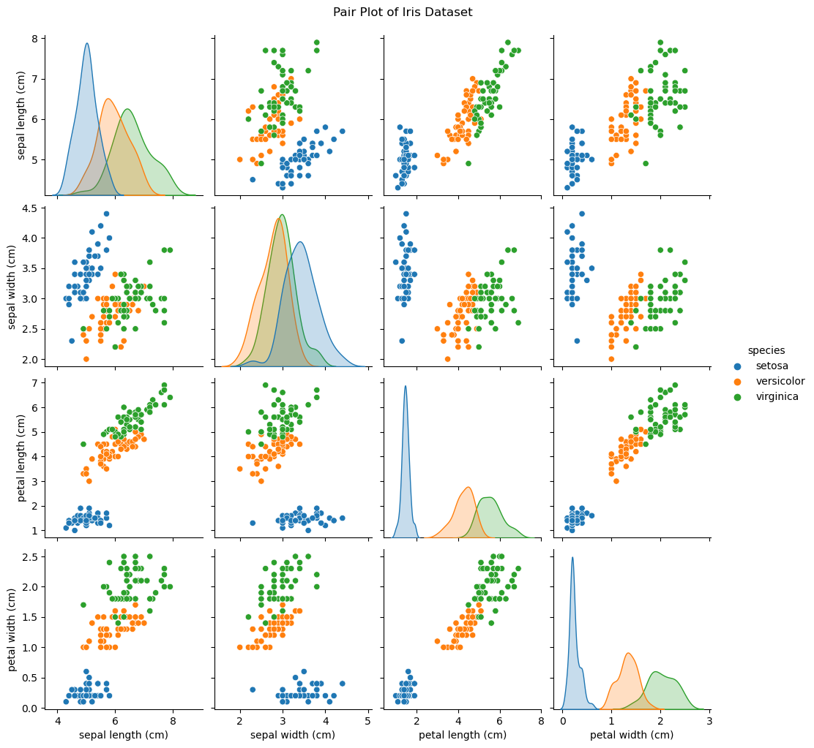
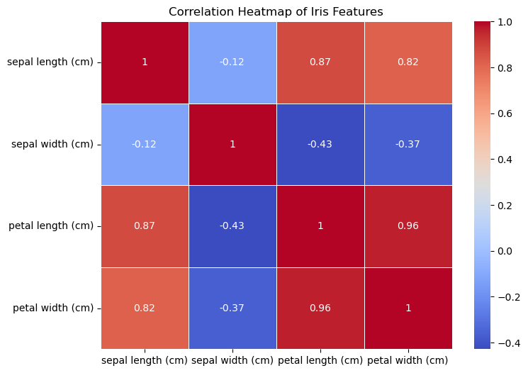
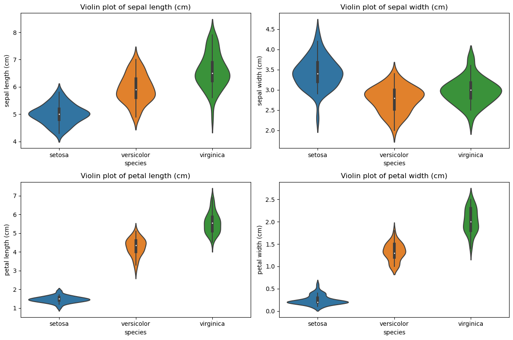
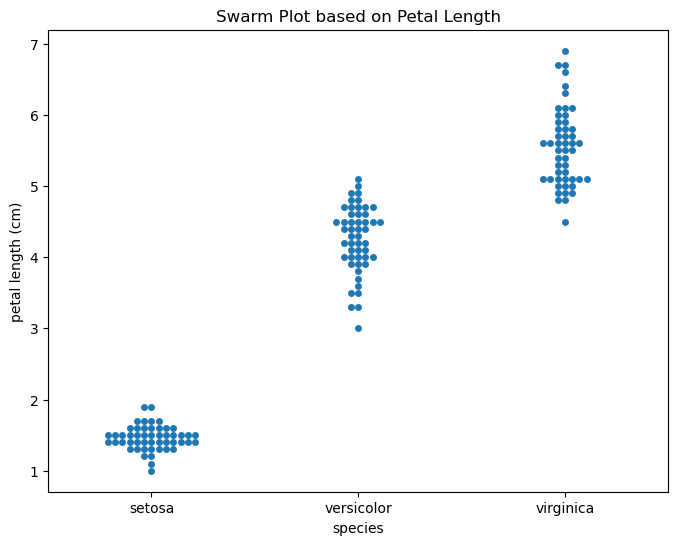
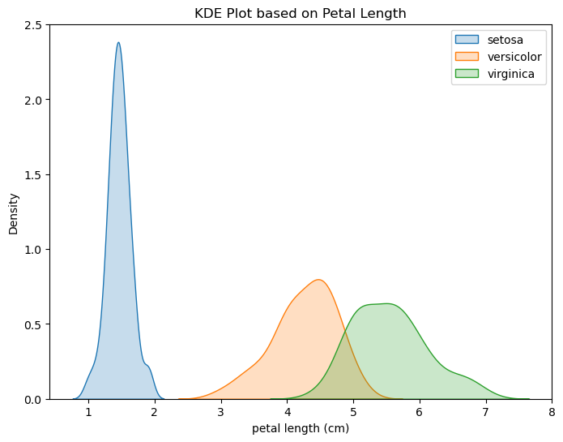
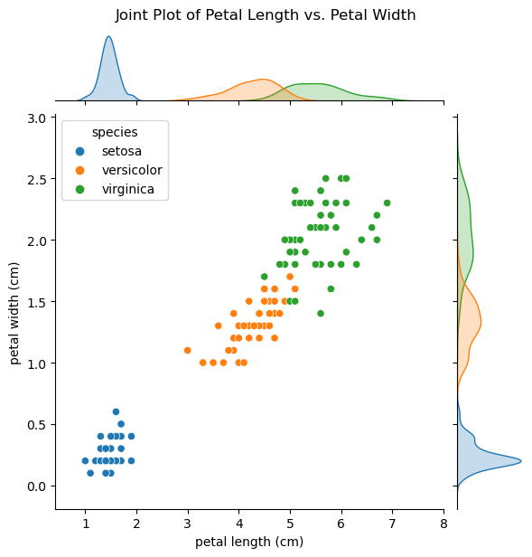

## Iris Data Visualisation and Analysis

This repository displays a comprehensive exploration of the Iris dataset, unveiling patterns and relationships between its features. It stands as a testament to the repository owner's adeptness in data analysis and visualisation.

### Pair Plot
The pair plot offers a pairwise relationship for each feature duo. Its diagonal reveals a single feature's distribution via a histogram, while scatter plots dominate the off-diagonal elements.

#### Analysis
For the Iris dataset, a pronounced separation is evident between the setosa species and the other two (versicolor and virginica), predominantly based on attributes such as petal length and petal width. However, versicolor and virginica exhibit some overlap.

### Correlation Heatmap
The heatmap elucidates the correlation amongst the dataset's diverse features. A shade closer to red indicates a higher positive correlation, whereas a shade leaning towards blue suggests a higher negative correlation.

#### Analysis
The Iris dataset highlights a robust positive correlation between petal length and petal width. On the contrary, a negative correlation is discerned between petal length and sepal width.

### Violin Plots
Blending features of box plots and KDE plots, the violin plot unveils data distribution and its probability density.

#### Analysis
For the Iris dataset, setosa distinctly showcases shorter petal lengths and widths compared to the other species. While versicolor and virginica present an overlap in their distributions, virginica typically possesses larger values.

### Swarm Plot
A swarm plot exhibits data distribution without overlaps, offering insights into data point density.

#### Analysis
For the Iris dataset, the swarm plot distinctly separates setosa based on petal length. Nonetheless, a certain overlap between versicolor and virginica underscores the similarities they share for the said feature.

### KDE Plot
The KDE plots provide a visual representation of data distribution, shedding light on its probability density.

#### Analysis
The Iris dataset's KDE plot accentuates the setosa species' distinctly smaller petal lengths. While versicolor generally sports medium petal lengths, virginica claims the longest.

### Joint Plot
Joint plots amalgamate bivariate scatter plots with univariate histograms on the peripheries, offering insights into two features' correlation.

#### Analysis
For the Iris dataset, the joint plot between petal length and petal width underscores a clear positive correlation: as one increases, so does the other. Furthermore, the distinct separation of setosa, attributed to its smaller petals, from the other species is quite evident.
